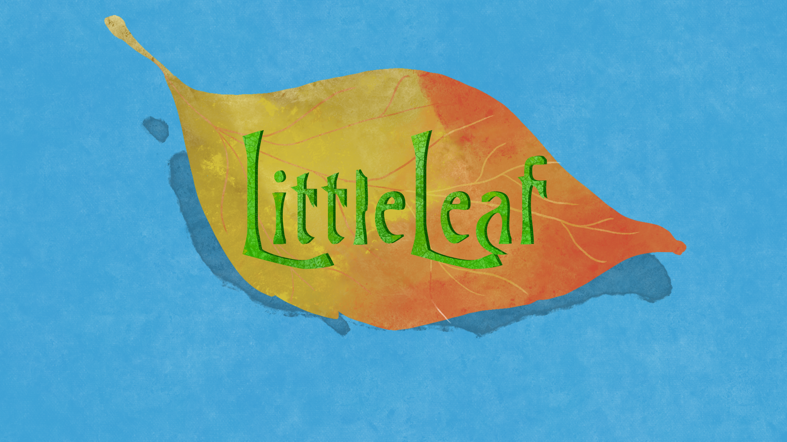

# Little Leaf Design Document

## Story

In an undeveloped land (Little Leaf), you are an alchemist/potion maker.
You start your exploration and research of the land as it is being founded.
You play as a potion shop keeper in a developing kingdom/town
This game serves as an origin story of a shopkeeper
Plan is for a series of games in same environment detailing backstories of its characters

### Setting

Little Leaf

## Gameplay

- solve puzzles, create and sell potions, explore and collect materials
- go out and explore. behind shop is greenhouse for growing new found materials
- large environment to explore (deserts, snowy mountains, forests, etc)
- update a log/recipe book
- update map

### Alchemy / Potion Crafting

- 7 levels of heat (Burning Hot, Hot, Warm, Normal, Cool, Cold, Freezing Cold)
- When potion crafting, ingredients being prepared have a timer
  - eg. When things are heated up, they will cool down after a certain time

## Mechanics

- inspiration spems from league of legends, moonlighter, overcooked, animal crossing, dont starve
- controls/movement like LoL
- fog of war when out exploring similar to LoL
- ability to set up shop placement like animal crossing
- ability to farm/build and affect environment like animal crossing
- ability to chop/cook/prepare ingredients like overcooked
- day and night system like dont starve
- week system (5 days)
- townsfolk requests are the quests
- survive raids from neighboring towns
- exhaustion
- save points at bed
  
## Game Elements

- Trees, building, brush, enemies, etc.

## Assets

- look at Moonlighter, Hyperlight Drifer for style

### Music

### SoundFX

### 2D

#### Splash

#### Environment

#### Characters

##### Main Character

Idle
Movement (U, D, L, R)
Dig  (Holding a shovel)
Dig Fail Sprites
Prep Sprites (Preparing material)

#### Landmarks

- Trees
- Buildings
